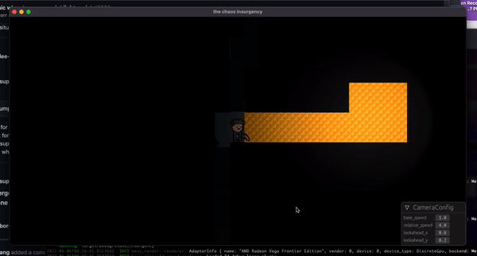

# bevy_sprite3d

Use 2d sprites in a 3d scene. This was my go-to workflow back when I was using
Unity. This crate replicates it in [bevy](https://bevyengine.org/).

Useful for:
- 2d games using bevy's lighting `(orthographic camera, 3d sprites)`
- 2d games with easier parallax and scale `(perspective camera, 3d sprites)`
- 2d games in a 3d world `(perspective camera, both 3d sprites and meshes)`

You could also use this for billboard sprites in a 3d game (a la
[Delver](https://cdn.cloudflare.steamstatic.com/steam/apps/249630/ss_0187dc55d24155ca3944b4ccc827baf7832715a0.1920x1080.jpg)),
so long as you set the sprite rotation.


Both meshes and materials are internally cached, so you can use this for things
like tilemaps without issue.

# Examples

Example using `bevy_sprite3d`:



Some more examples. These don't use bevy, but demonstrate the effect style:


# Usage

One small complication to usage is that your image assets need to be loaded
*prior* to spawning, as `bevy_sprite3d` uses some properties of the image (such
as size and aspect ratio) in constructing the sprite.

It's my understanding that bevy doesn't have a great way to do this yet.
To this end, I highly recommend using
[`bevy_asset_loader`](https://github.com/NiklasEi/bevy_asset_loader), though
the same functionality can be achieved manually.

The following examples will use `bevy_asset_loader` for simplicity. Even still,
most of the additional complexity is due to this loading-before-spawning
requirement (and not `bevy_sprite3d`). If anyone knows a simpler way to write
the examples, please update it!


## Single Sprite

```rust
use bevy::prelude::*;
use bevy_sprite3d::*;
use bevy_asset_loader::{AssetLoader, AssetCollection};


#[derive(Clone, Debug, Eq, Hash, PartialEq)]
enum GameState { Loading, Loaded, }

fn main() {
    let mut app = App::new();

    AssetLoader::new(GameState::Loading)
        .continue_to_state(GameState::Loaded)
        .with_collection::<ImageAssets>()
        .build(&mut app);

    app.add_state(GameState::Loading)
        .add_plugins(DefaultPlugins)
        .add_plugin(Sprite3dPlugin)
        .add_system_set( SystemSet::on_enter(GameState::Loaded).with_system(setup) );

    app.run();
}

#[derive(AssetCollection)]
struct ImageAssets {
    #[asset(path = "branding/icon.png")]
    icon: Handle<Image>,
}

fn setup(
    mut commands: Commands, 
    images: Res<ImageAssets>,
    mut sprite_params: Sprite3dParams) {

    commands.spawn_bundle(OrthographicCameraBundle::new_3d())
            .insert(Transform::from_xyz(0., 0., 18.5));

    commands.spawn_bundle(Sprite3d {
            image: images.icon.clone(),

            pixels_per_metre: 400.,

            partial_alpha: true,

            unlit: true,

            // transform: Transform::from_xyz(0., 0., 0.),
            // pivot: Some(Vec2::new(0.5, 0.5)),

            ..default()
    }.bundle(&mut sprite_params));
}
```

## Sprite Sheet

```rust
use bevy::prelude::*;
use bevy_sprite3d::*;
use bevy_asset_loader::{AssetLoader, AssetCollection};


#[derive(Clone, Debug, Eq, Hash, PartialEq)]
enum GameState { Loading, Loaded, }

fn main() {
    let mut app = App::new();

    AssetLoader::new(GameState::Loading)
        .continue_to_state(GameState::Loaded)
        .with_collection::<ImageAssets>()
        .build(&mut app);

    app.add_state(GameState::Loading)
        .add_plugins(DefaultPlugins)
        .add_plugin(Sprite3dPlugin)
        .add_system_set( SystemSet::on_enter(GameState::Loaded).with_system(setup) );

    app.run();
}


#[derive(AssetCollection)]
struct ImageAssets {
    #[asset(texture_atlas(tile_size_x = 24., tile_size_y = 24.))]
    #[asset(texture_atlas(columns = 7, rows = 1))]
    #[asset(path = "textures/rpg/chars/gabe/gabe-idle-run.png")]
    run: Handle<TextureAtlas>,
}

fn setup(
    mut commands: Commands, 
    images: Res<ImageAssets>,
    mut sprite_params: Sprite3dParams) {

    commands.spawn_bundle(OrthographicCameraBundle::new_3d())
            .insert(Transform::from_xyz(0., 0., 18.5));

    commands.spawn_bundle(AtlasSprite3d {
            atlas: images.run.clone(),

            pixels_per_metre: 32.,
            partial_alpha: true,
            unlit: true,

            index: 3,

            // transform: Transform::from_xyz(0., 0., 0.),
            // pivot: Some(Vec2::new(0.5, 0.5)),

            ..default()
    }.bundle(&mut sprite_params));
}
```


